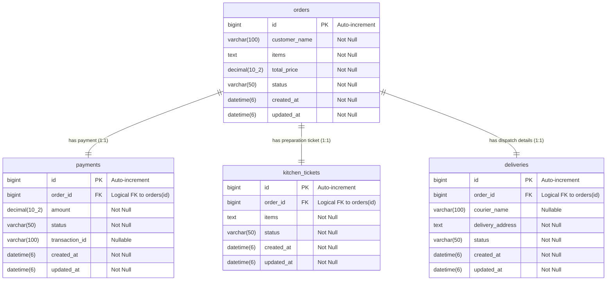

# Database Design Document: Online Food Order Processing System

This document outlines the database architecture, schema definitions, logical relations, and domain boundaries for the Online Food Order Processing System.

---

## 1. Entity Relationship (ER) Diagram
The following ER diagram maps the core database entities and their logical connections.

---

## 2. Table Schemas

### 2.1 `orders` Table
Stores primary information regarding a customer's order.
* **Domain Owner**: `order-service`
* **Schema Definition**:

| Column Name | Data Type | Nullability | Key | Default Value | Notes / Description |
| :--- | :--- | :--- | :--- | :--- | :--- |
| `id` | `bigint` | `NO` | `PK` | *None* | Unique auto-incrementing ID. |
| `customer_name` | `varchar(100)` | `NO` | - | *None* | Customer who placed the order. |
| `items` | `text` | `NO` | - | *None* | String list of order items. |
| `total_price` | `decimal(10,2)` | `NO` | - | *None* | Total checkout amount. |
| `status` | `varchar(50)` | `NO` | - | *None* | State of the order workflow. |
| `created_at` | `datetime(6)` | `NO` | - | *None* | Timestamp of creation. |
| `updated_at` | `datetime(6)` | `NO` | - | *None* | Timestamp of last status modification. |

---

### 2.2 `payments` Table
Maintains transaction details and checkout status.
* **Domain Owner**: `payment-service`
* **Schema Definition**:

| Column Name | Data Type | Nullability | Key | Default Value | Notes / Description |
| :--- | :--- | :--- | :--- | :--- | :--- |
| `id` | `bigint` | `NO` | `PK` | *None* | Unique auto-incrementing payment run ID. |
| `order_id` | `bigint` | `NO` | - | *None* | Logical identifier of the associated order. |
| `amount` | `decimal(10,2)` | `NO` | - | *None* | Paid quantity. |
| `status` | `varchar(50)` | `NO` | - | *None* | Payment status (e.g. `PENDING`, `COMPLETED`, `FAILED`). |
| `transaction_id` | `varchar(100)` | `YES` | - | *None* | External unique payment gateway transaction token. |
| `created_at` | `datetime(6)` | `NO` | - | *None* | Timestamp of transaction initiation. |
| `updated_at` | `datetime(6)` | `NO` | - | *None* | Timestamp of state change. |

---

### 2.3 `kitchen_tickets` Table
Represents tickets dispatched to the kitchen for food preparation.
* **Domain Owner**: `kitchen-service`
* **Schema Definition**:

| Column Name | Data Type | Nullability | Key | Default Value | Notes / Description |
| :--- | :--- | :--- | :--- | :--- | :--- |
| `id` | `bigint` | `NO` | `PK` | *None* | Unique ticket ID. |
| `order_id` | `bigint` | `NO` | - | *None* | Logical reference linking ticket back to the order. |
| `items` | `text` | `NO` | - | *None* | List of items for kitchen staff. |
| `status` | `varchar(50)` | `NO` | - | *None* | Prep state (e.g., `PREPARING`, `READY`). |
| `created_at` | `datetime(6)` | `NO` | - | *None* | Timestamp of ticket assignment. |
| `updated_at` | `datetime(6)` | `NO` | - | *None* | Timestamp of completion/update. |

---

### 2.4 `deliveries` Table
Handles logistical dispatch details and tracking couriers.
* **Domain Owner**: `delivery-service`
* **Schema Definition**:

| Column Name | Data Type | Nullability | Key | Default Value | Notes / Description |
| :--- | :--- | :--- | :--- | :--- | :--- |
| `id` | `bigint` | `NO` | `PK` | *None* | Unique tracking ID. |
| `order_id` | `bigint` | `NO` | - | *None* | Logical reference connecting delivery details to order. |
| `courier_name` | `varchar(100)` | `YES` | - | *None* | Assigned delivery driver's name. |
| `delivery_address` | `text` | `NO` | - | *None* | Physical drop-off location address. |
| `status` | `varchar(50)` | `NO` | - | *None* | Status (e.g., `SHIPPED`, `DELIVERED`). |
| `created_at` | `datetime(6)` | `NO` | - | *None* | Timestamp of dispatch entry. |
| `updated_at` | `datetime(6)` | `NO` | - | *None* | Timestamp of progress changes. |

---

## 3. Architecture Details

### 3.1 Logical Relationships (1:1 Relationships)
Since this is a microservices-based system, physical foreign key constraints (`CONSTRAINT FK_...`) are intentionally **not** registered in the MySQL database between tables owned by different microservices. This prevents tight database coupling. Instead, the logical relationship between the tables is maintained by microservices via event communication (using ActiveMQ JMS queues) and managed workflows (using Camunda BPMN engines).

* **Orders & Payments (1:1)**: Every valid order has exactly one payment cycle associated with it, connected via `payments.order_id = orders.id`.
* **Orders & Kitchen Tickets (1:1)**: Once payment succeeds, one ticket is dispatched to the kitchen containing prep details, connected via `kitchen_tickets.order_id = orders.id`.
* **Orders & Deliveries (1:1)**: A successful food prep triggers a single delivery cycle to dispatch the driver, connected via `deliveries.order_id = orders.id`.

### 3.2 Camunda BPM Engine Tables
In addition to the business data schemas listed above, the database contains numerous system tables prefixing with `act_*` (such as `act_ru_execution`, `act_hi_procinst`, `act_re_procdef`). These are managed automatically by the **Camunda BPM Engine** integrated into the `order-service` to track execution history, current runtime states, processes, and authorization definitions.
