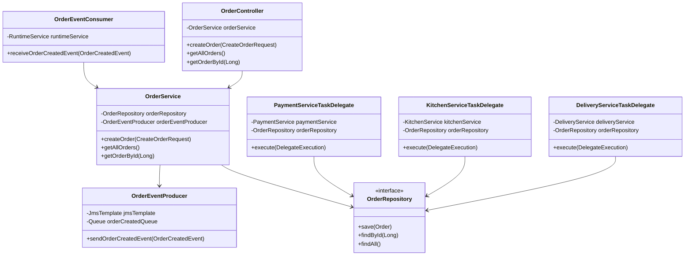
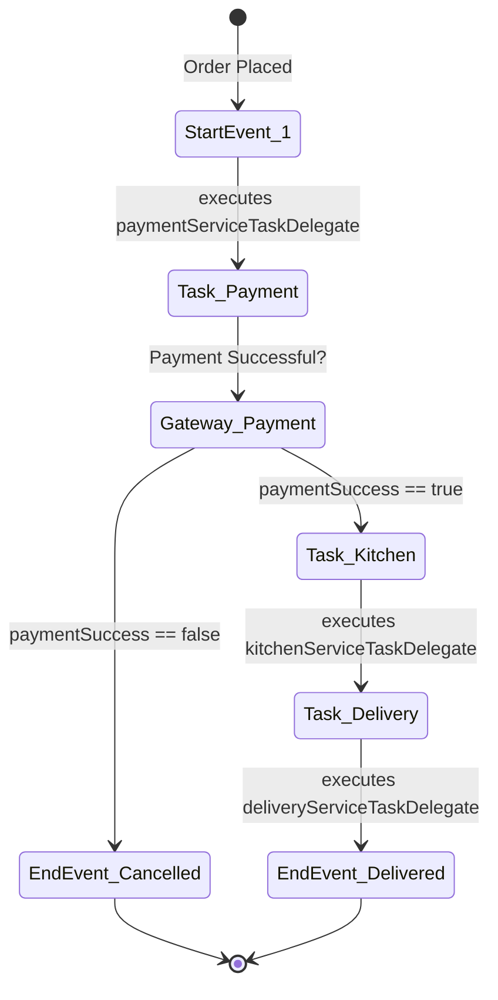
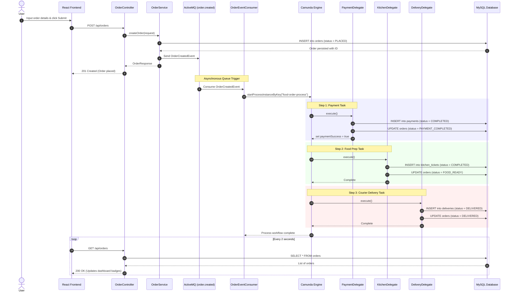
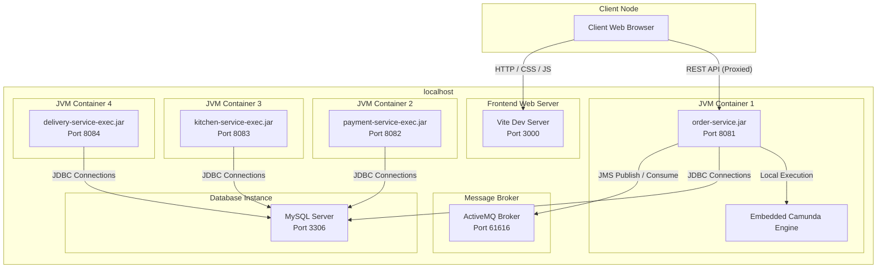

# Low-Level Design (LLD): Online Food Order Processing System

This document provides a Low-Level Design (LLD) detailing the class designs, components, workflows, events, and interactions of the Online Food Order Processing System.

---

## 1. System Architecture
The system follows a distributed architecture composed of a **React Single Page Application (SPA)** frontend, a **Spring Boot microservices** backend, an **Apache ActiveMQ JMS broker**, and a **MySQL** database.

```
+------------------+         REST API         +---------------------+
|  React Frontend  | -----------------------> |    order-service    |
|   (Vite Port)    |                          |   (Orchestrator)    |
+------------------+                          +---------------------+
                                                         |
                                                Runs Camunda Engine
                                                         |
                                                         v
                                              +---------------------+
                                              |    Camunda BPMN     |
                                              |  Process Execution  |
                                              +---------------------+
                                              /          |          \
                                 Instantiates         Locally        Invokes
                                 via Classpath       Classpath      via Classpath
                                     /                   |              \
                                    v                    v               v
                           +-----------------+ +----------------+ +------------------+
                           | payment-service | |kitchen-service | | delivery-service |
                           +-----------------+ +----------------+ +------------------+
                                    \                    |               /
                                     --------------------+---------------
                                                         |
                                               Logical SQL Updates
                                                         v
                                                +------------------+
                                                |    MySQL DB      |
                                                | (food_order_db)  |
                                                +------------------+
```

---

## 2. Microservice Architecture
The backend is structured as a multi-module Maven project where services are compiled and packaged independently. For orchestration, `order-service` includes the other services as direct dependencies, allowing local instantiation of delegates while the services run as independent network listening processes.

* **`order-service` (Port 8081)**: Owns order orchestration. Integrates the Camunda engine, handles incoming REST APIs, creates initial order status (`PLACED`), and publishes events to ActiveMQ.
* **`payment-service` (Port 8082)**: Evaluates transaction details, creates `payments` logs, and determines transaction approvals/failures.
* **`kitchen-service` (Port 8083)**: Registers kitchen tickets, tracks prep status, and manages food preparation stages.
* **`delivery-service` (Port 8084)**: Assigns courier drivers, manages delivery addresses, and logs delivery success states.

---

## 3. Component Diagram
The internal layers of the backend services follow a standard controller-service-repository design.



---

## 4. Request Flow
1. **Submit Order**: The user presses "Place Order" on the React page. The UI fires an HTTP POST `/api/orders` request.
2. **Persistence**: `OrderController` receives the request. `OrderService` inserts a new row in the `orders` table with the status `PLACED`.
3. **Queue Publishing**: `OrderService` sends an `OrderCreatedEvent` to the `order.created` JMS queue via `OrderEventProducer`.
4. **Camunda Start**: `OrderEventConsumer` listens to `order.created`, parses the event details, and triggers the `food-order-process` workflow instance in the Camunda Engine.
5. **Orchestration**: The Camunda engine executes the BPMN workflow steps, calling task delegates in sequence to process payments, kitchen tickets, and deliveries.
6. **Dashboard Refresh**: The React dashboard continuously polls `/api/orders` (every 2 seconds) to display real-time progress as order states cycle from `PLACED` $\rightarrow$ `PAYMENT_COMPLETED` $\rightarrow$ `FOOD_READY` $\rightarrow$ `DELIVERED`.

---

## 5. Camunda BPMN Flow
The Camunda BPMN workflow is defined in `food-order-process.bpmn` and manages order state transitions:



- **`paymentServiceTaskDelegate`**: Invokes `PaymentService` to check the amount. If the amount is `$99.99`, payment fails (`paymentSuccess = false`). Upon success, status updates to `PAYMENT_COMPLETED`.
- **`kitchenServiceTaskDelegate`**: Invokes `KitchenService` to log items to `kitchen_tickets` and transitions status to `FOOD_READY`.
- **`deliveryServiceTaskDelegate`**: Invokes `DeliveryService` to log dispatcher details to `deliveries` and transitions status to `DELIVERED`.

---

## 6. ActiveMQ Event Flow
Asynchronous messaging decoupling is driven by Apache ActiveMQ broker queues.

- **Broker URL**: `tcp://localhost:61616` (Admin console: `http://localhost:8161`)
- **Queue Details**:
  - `order.created`: Contains `OrderCreatedEvent` details (ID, customer, items, price).
- **Producers & Consumers**:
  - **Producer**: `OrderEventProducer` publishes to `order.created` inside the transaction boundary of order placement.
  - **Consumer**: `OrderEventConsumer` consumes events from `order.created` to launch process tasks asynchronously.

---

## 7. REST API Communication
Vite web-server handles request routing by proxying frontend requests:

```
[UI Client HTTP Call] ---> [Vite Dev Server (Port 3000)]
                                      |
                             Proxies "/api" path
                                      v
                        [order-service Tomcat (Port 8081)]
```

### Endpoints
* **`POST /api/orders`**: Creates a new order.
  - *Request Body*: `{"customerName": "Alice", "item": "Pizza", "amount": 15.50}`
  - *Response*: `{"id": 1, "customerName": "Alice", "item": "Pizza", "amount": 15.50, "status": "PLACED", "createdAt": "..."}`
* **`GET /api/orders`**: Retrieves a list of all active/past orders.
* **`GET /api/orders/{id}`**: Retrieves state details of a single order.

---

## 8. Database Interaction
All database transactions are mapped via Hibernate ORM (JPA) pointing to the shared MySQL database `food_order_db`.

* **JPA Configurations**:
  - `spring.jpa.hibernate.ddl-auto: update` (Automatically registers tables and adapts mappings).
  - Primary keys are configured with `@GeneratedValue(strategy = GenerationType.IDENTITY)`, mapping to MySQL `bigint AUTO_INCREMENT`.
  - Date and time stamps map to high-precision fractional seconds `datetime(6)`.
  - Large text blocks (e.g. order items, delivery addresses) map to `TEXT` type fields.

---

## 9. Package Structure
```
com.foodorder
 │
 ├── controller/          # REST Endpoints (OrderController.java)
 ├── delegate/            # Camunda task handlers (PaymentServiceTaskDelegate.java, etc.)
 ├── dto/                 # Data Transfer Objects & Events (CreateOrderRequest.java, etc.)
 ├── entity/              # JPA Database Mappings (Order.java, Payment.java, etc.)
 ├── repository/          # Spring Data Interfaces (OrderRepository.java, etc.)
 └── service/             # Domain logic layer (OrderService.java, etc.)
```

---

## 10. Technology Stack
- **Languages**: Java 21+, JavaScript (ES6+).
- **Frameworks**: Spring Boot 3.3.4 (MVC, Data JPA), React 19.
- **Workflow Orchestrator**: Camunda BPM Platform 7.21.0 (Embedded).
- **Messaging Broker**: Apache ActiveMQ 5.18.3.
- **Relational Database**: MySQL Server 8.0.
- **Build & Development Tools**: Maven 3.x, Vite 8, Node.js.

---

## 11. Sequence Diagram
The diagram below details the end-to-end execution of a successful food order placement:



---

## 12. Deployment Diagram
A node-level overview of the local running environment:


